# GymOps — Entity Relationship Diagram (Draft v4)

Revised after discussion: adds resource management as first-class temporal bookings.
Rooms, equipment, and coaches are no longer static defaults/FKs on a session — they
are reservable resources with a time window, so the system can detect double-bookings
and over-allocation (e.g. requesting more kettlebells than the gym owns, or assigning
a coach to two overlapping sessions).

## Where double-booking prevention lives

None of `SPACE_BOOKING`, `EQUIPMENT_BOOKING`, or `STAFF_BOOKING` overlapping is allowed
for the same resource. This is a **data integrity invariant, not a workflow rule** — if
it's only enforced in application code ("check for conflicts, then insert"), concurrent
requests can both pass the check and both insert, because nothing prevents the race.
The actual guarantee has to live at the database layer:

- `SPACE_BOOKING` / `STAFF_BOOKING`: an exclusion constraint on
  `(resource_id WITH =, tstzrange(starts_at, ends_at) WITH &&)` — Postgres refuses to
  commit a second overlapping row for the same resource.
- `EQUIPMENT_BOOKING`: slightly different, since it's not "no overlap" but "sum of
  overlapping quantities ≤ `total_quantity`" — needs either a serialized transaction
  with a `SUM()` check or a trigger, since a plain exclusion constraint can't express it.

The **business/application layer's job is different**: query current bookings to show
availability *before* the user commits ("this room is free 17:00–18:00", "4 kettlebells
left for that slot") for good UX, and give a friendly error on the rare case a conflict
still occurs. That layer makes conflicts rare; the database constraint makes them
impossible.

**No override exists.** Per the client's decision, a double-booking is never resolved by
forcing it through — a person, room, or unit of equipment cannot be in two places at
once, full stop. The only valid resolutions are to **cancel one of the conflicting
bookings** (which may mean cancelling the `CLASS_SESSION` itself, if e.g. the coach or
room has no substitute) **or remove/reassign the conflicting assignment** before the
write is attempted. This means there is no "force-book anyway" code path to build: the
exclusion constraint simply rejects the write, and the UI's job is to surface that
rejection and offer cancel/reassign as the next actions — not to provide a bypass.

## Key design decisions baked into this model

- **PERSON is the base identity** for anyone — member, guardian, or staff. There is no
  separate `MEMBER`/`GUARDIAN` wrapper entity: a person's *relationship to an account*
  (as the payer, or as someone the account covers) is what matters, not a role label.
- **ACCOUNT is the billing unit.** It links to one or more `PERSON`s via `ACCOUNT_MEMBER`.
  A kid and an adult on the same account are modeled identically — no special-casing.
- **COURSE / GROUP / CLASS_SESSION are three distinct layers**, matching how the client
  actually thinks about scheduling:
  - `COURSE` — the activity itself (Judo, TRX, Parkour...). Fixed. Carries *default*
    material requirements via `COURSE_REQUIREMENT` — informational planning data, not
    an actual reservation.
  - `GROUP` — a course running on a fixed cadence (e.g. "Judo, Tue/Thu 17:00"). Course
    and schedule are fixed once a group exists.
  - `CLASS_SESSION` — one dated occurrence of a group. Coach still defaults from the
    group but is assignable per session (substitute coach for one Tuesday).
- **Resource booking is now temporal and decoupled from static FKs.** Rooms and
  equipment are `SPACE_BOOKING` / `EQUIPMENT_BOOKING` records with explicit
  `starts_at`/`ends_at`, not a plain `space_id` column on `CLASS_SESSION`:
  - `SPACE_BOOKING` reserves a room for a session's time window. Two bookings for the
    same `SPACE` must never overlap in time — that's a validation rule the booking
    table exists to make checkable.
  - `EQUIPMENT_BOOKING` reserves a *quantity* of an equipment type for a time window,
    made either automatically (prefilled from `COURSE_REQUIREMENT` when a session is
    created) or ad hoc by the coach ("tomorrow we need elastic bands and kettlebells").
    The sum of overlapping bookings for one equipment type must never exceed
    `EQUIPMENT.total_quantity`.
  - Both booking types carry `booked_by_staff_id` so an ad-hoc coach request is
    distinguishable from a default/admin-planned booking.
- **Coach assignment is now a booking too.** `STAFF_BOOKING` mirrors `SPACE_BOOKING`:
  a coach cannot be assigned to two overlapping `CLASS_SESSION`s, enforced the same way
  as room conflicts. `GROUP.default_coach_staff_id` remains a plain default used to
  prefill a new session's `STAFF_BOOKING`, not a booking itself.
- **SUBSCRIPTION is the contractual link between a PERSON and a GROUP** — per the
  client's own definition.
- **WAIVER keeps two person references on purpose**: `subject_person_id` (whose liability
  is waived — may be a minor) and `signed_by_person_id` (who has legal authority to sign —
  a guardian, for a minor).
- **Coach vs. admin permission boundaries are intentionally left unmodeled** — pending
  the client's answer on which decisions belong to which role.

## Diagram

```mermaid
erDiagram
    ACCOUNT ||--o{ ACCOUNT_MEMBER : covers
    ACCOUNT_MEMBER }o--|| PERSON : identifies
    ACCOUNT ||--o{ PAYMENT_METHOD : holds
    ACCOUNT ||--o{ INVOICE : receives

    INVOICE ||--o{ PAYMENT : "settled by"
    PAYMENT }o--|| PAYMENT_METHOD : "charged via"
    INVOICE }o--o{ SUBSCRIPTION : "covers billing period for"

    PERSON ||--o{ SUBSCRIPTION : "is party to"
    GROUP ||--o{ SUBSCRIPTION : includes
    SUBSCRIPTION }o--|| SUBSCRIPTION_PLAN : "priced under"

    COURSE ||--o{ GROUP : "manifested as"
    COURSE ||--o{ COURSE_REQUIREMENT : "specifies (default, informational)"
    EQUIPMENT ||--o{ COURSE_REQUIREMENT : "required as"

    GROUP ||--o{ CLASS_SESSION : schedules
    GROUP }o--|| STAFF : "default coach (prefill only)"
    GROUP ||--|| GROUP_VISIBILITY_SETTING : configures

    CLASS_SESSION ||--o| STAFF_BOOKING : "coached by"
    STAFF ||--o{ STAFF_BOOKING : "reserved via"
    STAFF ||--o{ STAFF_BOOKING : "assigned by (booked_by)"

    CLASS_SESSION ||--o| SPACE_BOOKING : "held in"
    SPACE ||--o{ SPACE_BOOKING : "reserved via"
    STAFF ||--o{ SPACE_BOOKING : "booked by"

    CLASS_SESSION ||--o{ EQUIPMENT_BOOKING : requests
    EQUIPMENT ||--o{ EQUIPMENT_BOOKING : "reserved via"
    STAFF ||--o{ EQUIPMENT_BOOKING : "booked by"

    CLASS_SESSION ||--o{ ATTENDANCE : records
    PERSON ||--o{ ATTENDANCE : "attends via"

    PERSON ||--o{ WAIVER : "is subject of"
    PERSON ||--o{ WAIVER : "signs (if legal guardian)"

    PERSON ||--o| STAFF : "may also be"

    PERSON {
        uuid id
        string full_name
        date date_of_birth
        string email
        string phone
    }

    ACCOUNT {
        uuid id
        uuid owner_person_id
        string billing_email
        enum status
    }

    ACCOUNT_MEMBER {
        uuid id
        uuid account_id
        uuid person_id
        date linked_at
    }

    STAFF {
        uuid id
        uuid person_id
        enum role "coach, admin, owner"
    }

    PAYMENT_METHOD {
        uuid id
        uuid account_id
        enum type "sepa_direct_debit, card, bizum"
        string token_ref
    }

    SUBSCRIPTION_PLAN {
        uuid id
        string name
        decimal price
        enum billing_cycle "weekly, monthly"
    }

    SUBSCRIPTION {
        uuid id
        uuid person_id
        uuid group_id
        uuid subscription_plan_id
        enum status "active, frozen, cancelled"
        date start_date
    }

    INVOICE {
        uuid id
        uuid account_id
        decimal amount
        date issue_date
        enum status "pending, paid, failed, overdue"
    }

    PAYMENT {
        uuid id
        uuid invoice_id
        uuid payment_method_id
        decimal amount
        date paid_at
        enum status "success, failed, retried"
    }

    COURSE {
        uuid id
        string name
        string discipline
        string description
    }

    COURSE_REQUIREMENT {
        uuid id
        uuid course_id
        uuid equipment_id
        int quantity_needed
    }

    EQUIPMENT {
        uuid id
        string name
        string type
        int total_quantity
    }

    EQUIPMENT_BOOKING {
        uuid id
        uuid equipment_id
        uuid class_session_id
        int quantity
        datetime starts_at
        datetime ends_at
        uuid booked_by_staff_id
        enum status "requested, confirmed, cancelled"
    }

    SPACE {
        uuid id
        string name
        int capacity
        string location_notes
    }

    SPACE_BOOKING {
        uuid id
        uuid space_id
        uuid class_session_id
        datetime starts_at
        datetime ends_at
        uuid booked_by_staff_id
        enum status "confirmed, cancelled"
    }

    STAFF_BOOKING {
        uuid id
        uuid staff_id "the coach being assigned"
        uuid class_session_id
        datetime starts_at
        datetime ends_at
        uuid booked_by_staff_id "who made the assignment"
        enum status "confirmed, cancelled"
    }

    GROUP {
        uuid id
        uuid course_id
        string cadence_description "e.g. Tue/Thu 17:00"
        uuid default_coach_staff_id
        int capacity
        string age_bracket
    }

    GROUP_VISIBILITY_SETTING {
        uuid id
        uuid group_id
        boolean coach_sees_billing_status
    }

    CLASS_SESSION {
        uuid id
        uuid group_id
        datetime starts_at
        int capacity_override
        enum status "scheduled, cancelled, completed"
    }

    ATTENDANCE {
        uuid id
        uuid class_session_id
        uuid person_id
        enum status "present, absent, excused, makeup"
    }

    WAIVER {
        uuid id
        uuid subject_person_id
        uuid signed_by_person_id
        date signed_at
        string document_ref
    }
```

## Open questions for the next pass

- **Ad-hoc / makeup attendance**: can a person attend a `CLASS_SESSION` for a group they
  don't hold a `SUBSCRIPTION` to (e.g. a one-off swap), or does every attendance require
  an active subscription to that specific group? If one-offs are allowed, `ATTENDANCE`
  needs some way to mark it as a covered makeup vs. a paid drop-in vs. unauthorized.
- **Coach vs. admin permission boundaries** — pending the client's decision. Once known,
  this likely becomes a permissions/policy table rather than new core entities.
- **Account↔Person cardinality over time**: can a person move between accounts (e.g. split
  custody billing)? `ACCOUNT_MEMBER` as a join table already supports this if we add
  effective-dating; flagging so it isn't lost.
- **Course requirement enforcement**: is `COURSE_REQUIREMENT` just informational (for
  prefilling a session's default `EQUIPMENT_BOOKING`s), or should it also validate a
  `SPACE`'s suitability (e.g. minimum floor area, mats available) when scheduling a group?
- **Booking conflict resolution**: when an ad-hoc `EQUIPMENT_BOOKING` would exceed
  `EQUIPMENT.total_quantity` for the requested window, does the system hard-block it,
  or just warn the coach/admin and let a human resolve it?
- **Group-level vs. session-level capacity**: `GROUP.capacity` is a default; does
  `CLASS_SESSION.capacity_override` ever get used in practice, or is it dead weight for v1?
